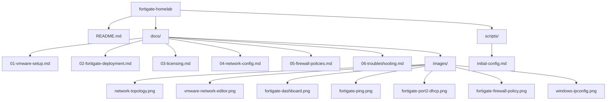

# 🛡️ FortiGate Homelab – Virtual Firewall Deployment

## 📖 Project Overview

This project documents the complete deployment of a **FortiGate Next‑Generation Firewall (NGFW)** as a virtual machine on **VMware Workstation**. The lab creates an isolated, enterprise‑like network environment to learn firewall administration, network segmentation, and security policy implementation.

The final setup provides a secure gateway for a Windows 10 client, routing traffic from an internal LAN to the internet via Network Address Translation (NAT).

## 🎯 Objectives

- Deploy and license a FortiGate VM (FortiOS) on a Type‑2 hypervisor.
- Design a segmented network with distinct WAN and LAN zones.
- Configure the FortiGate as the gateway and DHCP server for a Windows 10 client.
- Implement a firewall policy to allow controlled internet access for the client.
- Document the entire process, including all troubleshooting steps, for portfolio展示.

## 🏗️ Architecture & Topology

| Component | Interface | IP Address | Subnet |
|-----------|-----------|------------|--------|
| **Host PC (Windows 11)** | Physical NIC | 10.1.1.218 | 255.255.255.0 |
| **Home Router** | Gateway | 10.1.1.1 | 255.255.255.0 |
| **FortiGate port1 (WAN)** | Bridged (VMnet0) | 10.1.1.220 | 255.255.255.0 |
| **FortiGate port2 (LAN)** | Host‑only (VMnet2) | 192.168.1.1 | 255.255.255.0 |
| **Windows 10 Client** | Host‑only (VMnet2) | DHCP (192.168.1.100-200) | 255.255.255.0 |

## 🛠️ Technologies Used

- **Virtualization:** VMware Workstation 17 Pro
- **Firewall:** FortiGate VM (FortiOS v7.x)
- **Client OS:** Microsoft Windows 10 Pro
- **Documentation:** GitHub Markdown, draw.io (for diagrams)

## 🚀 Key Achievements

- Successfully deployed a multi‑node virtual network with full internet connectivity.
- Resolved a Layer‑2 connectivity issue by manually binding VMware's VMnet0 to the host's physical Wi‑Fi adapter – demonstrating strong troubleshooting skills.
- Fixed a persistent `curl 28` licensing timeout by synchronising system time via NTP and correcting DNS settings.
- Gained hands‑on experience with FortiOS CLI and GUI, covering interface configuration, DHCP, and firewall policies.

## 📂 Repository Structure



## 📚 Documentation

For detailed step‑by‑step guides, see the [`docs/`](docs/) folder:

1. **[VMware Setup](docs/01-vmware-setup.md)** – Configuring virtual networks and VM settings.
2. **[FortiGate Deployment](docs/02-fortigate-deployment.md)** – Deploying the FortiGate VM.
3. **[Licensing](docs/03-licensing.md)** – Activating the free permanent license and troubleshooting errors.
4. **[Network Configuration](docs/04-network-config.md)** – Setting up interfaces, IPs, and DHCP.
5. **[Firewall Policies](docs/05-firewall-policies.md)** – Creating the LAN‑to‑WAN policy with NAT.
6. **[Troubleshooting Log](docs/06-troubleshooting.md)** – Detailed log of issues and their resolutions.

---

# 1. VMware Workstation Setup

## Steps

### 1.1 Virtual Network Editor

1. Open VMware Workstation.
2. Go to **Edit > Virtual Network Editor**.
3. Click **"Change Settings"** (requires admin rights).
4. Select **VMnet0** (Bridged) and set it to **"Bridged to:"** your active physical adapter (Wi‑Fi or Ethernet) – **do not leave it on "Automatic"**.
5. Click **Add Network...**, select **VMnet2**, and set it to **Host‑only**.
6. For VMnet2, **uncheck "Use local DHCP service"** – we will let the FortiGate handle DHCP.
7. Click **Apply** and **OK**.

### 1.2 VM Hardware Settings

**FortiGate VM:**
- **CPU:** 1 vCPU
- **Memory:** 2048 MB (2 GB)
- **Network Adapter 1:** Bridged (VMnet0) → this becomes `port1` (WAN)
- **Network Adapter 2:** Custom (VMnet2) → this becomes `port2` (LAN)

**Windows 10 VM:**
- **Network Adapter:** Custom (VMnet2) → connects to the LAN side.

> **Important:** The free permanent license requires exactly **1 vCPU** and **2 GB RAM** – no more, no less. If you allocate more, the license validation will fail.

### 1.3 Verification

- Power on both VMs.
- On the FortiGate, run `get system interface physical` to confirm both `port1` and `port2` show `Link: up`.

---

# 2. FortiGate VM Deployment

## Steps

### 2.1 Deploy the VM

1. In VMware Workstation, go to **File > Open** and select the `.ovf` file of the FortiGate image.
2. Set the VM name and storage location.
3. Power on the VM.

### 2.2 Initial Login

- On first boot, log in with:
  - **Username:** `admin`
  - **Password:** (blank – just press Enter)
- Change the admin password when prompted.

### 2.3 Configure WAN Interface (port1)

Assign a static IP to `port1` (the WAN/management interface). Replace `10.1.1.220` with your own IP if needed.

```bash
config system interface
    edit port1
        set mode static
        set ip 10.1.1.220 255.255.255.0
        set allowaccess ping https ssh
    end
```

```bash
config router static
    edit 1
        set device port1
        set gateway 10.1.1.1
    next
end
```
```bash
config system dns
    set primary 8.8.8.8
    set secondary 8.8.4.4
end
```

```bash
execute ping 10.1.1.1
execute ping 8.8.8.8
```


Both should succeed. If not, check your VMware bridging settings and physical adapter binding.

# 3. Licensing the FortiGate VM
## Prerequisites
Internet connectivity (ping 8.8.8.8 works).

A FortiCare account (create one at https://support.fortinet.com).

The free trial is limited to one license per account – ensure you don't have another active trial.

## Steps
### 3.1 Synchronise System Time
SSL/TLS handshakes for licensing require accurate time. Set your timezone and enable NTP.

Find your timezone name:

```bash
get system timezone
```
(Scroll with Space to find your region, e.g., America/New_York)

Set the timezone:

```bash
config system global
    set timezone America/New_York   # replace with yours
end
```

Enable NTP:

```bash
config system ntp
    set ntpsync enable
    set server-mode enable
    set type custom
    set server "0.pool.ntp.org"
    set server "1.pool.ntp.org"
end

execute ntp-sync
```

Verify the time:

```bash
get system status
```
Look for System Time – it should now be correct.

### 3.2 Activate the License
Run these commands one by one (replace with your FortiCare credentials):

```bash
execute vm-license-options account-id your_email@example.com
execute vm-license-options account-password your_password
execute vm-license
```
The system will ask to reboot – type y and press Enter.

### 3.3 Verify
After reboot, run:

```bash
get system status
```
Look for License Status: Valid. You can also check with:

```bash
diagnose debug vm-print-license
```

## Troubleshooting

| Symptom | Likely Cause | Solution |
|---------|--------------|----------|
| `curl 28` timeout | Wrong system time | Fix NTP and try again. |
| `Invalid serial number` | Serial not registered or account limit reached | Register the serial manually on the Fortinet Support Portal (Asset > Register/Activate). |
| `ping support.fortinet.com` fails | DNS not set | Set DNS to `8.8.8.8` as shown above. |
| License still invalid after reboot | VM has more than 1 vCPU or 2 GB RAM | Reduce resources and retry. |

### Manual Fallback (Offline License)

If online activation continues to fail, download the `.lic` file from the Fortinet Support Portal and upload it via the GUI:

1. Go to **Asset > Manage/View Products**.
2. Find your serial number and click **"Download License File"**.
3. In the FortiGate GUI, go to **System > Dashboard** and click **"Upload License"**.
4. Select the `.lic` file and reboot.

---

# 4. Network Configuration – LAN (port2) and DHCP

## Steps

### 4.1 Configure port2 Interface

1. In the FortiGate web GUI (`https://10.1.1.220`), go to **Network > Interfaces**.
2. Click **Edit** on the `port2` interface.
3. Fill in:
   - **Alias:** `LAN`
   - **Role:** `LAN`
   - **Addressing mode:** `Manual`
   - **IP/Netmask:** `192.168.1.1/255.255.255.0`
   - **Administrative Access:** check `PING`, `HTTPS`, `SSH`
4. Click **OK**.

### 4.2 Enable DHCP Server

Scroll down in the same `port2` edit page to the **DHCP Server** section:

- Check **Enable DHCP Server**.
- **IP Range:** `192.168.1.100` – `192.168.1.200`
- **Netmask:** `255.255.255.0`
- **Default Gateway:** `192.168.1.1`
- **DNS Server:** `8.8.8.8`, `8.8.4.4`
- Click **OK**.

### 4.3 Configure Windows 10 Client

1. Power on the Windows 10 VM.
2. Open **Control Panel > Network and Sharing Center > Change adapter settings**.
3. Right‑click the network adapter and select **Properties**.
4. Select **Internet Protocol Version 4 (TCP/IPv4)** and click **Properties**.
5. Select **Obtain an IP address automatically** and **Obtain DNS server address automatically**.
6. Click **OK** and close.

### 4.4 Verification

- Open a command prompt on Windows 10.
- Run `ipconfig`. You should see an IP like `192.168.1.100`.
- Run `ping 192.168.1.1` – it should succeed.

---

# 5. Firewall Policy – LAN to WAN

## Steps

### 5.1 Create the Policy

1. In the FortiGate GUI, go to **Policy & Objects > Firewall Policy**.
2. Click **Create New**.
3. Configure these settings:
   - **Name:** `LAN to WAN`
   - **Incoming Interface:** `port2`
   - **Outgoing Interface:** `port1`
   - **Source:** `all`
   - **Destination:** `all`
   - **Schedule:** `always`
   - **Service:** `ALL`
   - **Action:** `ACCEPT`
4. Under the **NAT** tab, check **Use Outbound Interface Address**.
5. Click **OK**.

### 5.2 Verification

- On the Windows 10 VM, open a web browser.
- Try to visit any website (e.g., `http://example.com` or `https://google.com`).
- The page should load successfully.

If it doesn't work:
- Check that the policy is at the top of the list (rules are processed top‑down).
- Verify that `port1` has internet access (ping 8.8.8.8 from the FortiGate CLI).
- Ensure the Windows VM has the correct gateway (`192.168.1.1`) and DNS.

---

# 6. Troubleshooting Log

## Issue 1: Layer‑2 Connectivity (ping to gateway failed)

**Symptom:**  
The FortiGate could not ping `10.1.1.1` (the gateway) even though the IP was correctly set on `port1`. ARP table was empty.

**Root Cause:**  
VMware's bridged network (VMnet0) was set to "Automatic", which sometimes binds to the wrong physical adapter (e.g., a virtual VPN adapter or an inactive Ethernet port).

**Solution:**  
Manually set VMnet0 to the **exact** physical Wi‑Fi or Ethernet adapter that your host is using.  
- In VMware Workstation: **Edit > Virtual Network Editor > Change Settings > VMnet0 > Bridged to:** select your active adapter.

**Prevention:** Always manually bind bridged adapters – never leave them on "Automatic" for production‑like labs.

---

## Issue 2: `curl 28` Licensing Timeout

**Symptom:**  
Running `execute vm-license` returned `curl forticare failed, 28` and the license never activated.

**Root Cause:**  
The system time was not synchronised with NTP. SSL/TLS handshakes with the FortiCare server require accurate time, otherwise the secure connection fails.

**Solution:**  
- Set the correct timezone.
- Enabled NTP with public pool servers (`0.pool.ntp.org`, `1.pool.ntp.org`).
- Forced a sync with `execute ntp-sync`.
- After time was correct, the license activation succeeded.

**Verification:** `get system status` showed correct `System Time`.

---

## Issue 3: DNS Resolution Failure

**Symptom:**  
`ping support.fortinet.com` failed, but `ping 8.8.8.8` worked.

**Root Cause:**  
No DNS servers were configured on the FortiGate.

**Solution:**  
Set primary and secondary DNS to `8.8.8.8` and `8.8.4.4` via:
```bash
config system dns
    set primary 8.8.8.8
    set secondary 8.8.4.4
end
```

Result: DNS resolution now works, and licensing proceeds correctly.

# 1. Set timezone (replace with yours)
```bash
config system global
    set timezone America/New_York
end
```

# 2. Enable NTP
```bash
config system ntp
    set ntpsync enable
    set server-mode enable
    set type custom
    set server "0.pool.ntp.org"
    set server "1.pool.ntp.org"
end
execute ntp-sync
```

# 3. Configure port1 (WAN)
```bash
config system interface
    edit port1
        set mode static
        set ip 10.1.1.220 255.255.255.0
        set allowaccess ping https ssh
    end
```

# 4. Set default gateway
```bash
config router static
    edit 1
        set device port1
        set gateway 10.1.1.1
    next
end
```

# 5. Set DNS
```bash
config system dns
    set primary 8.8.8.8
    set secondary 8.8.4.4
end
```

# 6. Verify connectivity
```bash
execute ping 10.1.1.1
execute ping 8.8.8.8
```

# 7. License activation (replace with your credentials)
```bash
execute vm-license-options account-id your_email@example.com
execute vm-license-options account-password your_password
execute vm-license
```

# 8. After reboot, configure port2 (LAN)
```bash
config system interface
    edit port2
        set mode static
        set ip 192.168.1.1 255.255.255.0
        set allowaccess ping https ssh
    end
```

# 9. Enable DHCP on port2 (CLI equivalent)
```bash
config system dhcp server
    edit 1
        set default-gateway 192.168.1.1
        set netmask 255.255.255.0
        set interface port2
        set ip-range 192.168.1.100 192.168.1.200
        set dns-server1 8.8.8.8
        set dns-server2 8.8.4.4
    end
```
# 10. Firewall policy (CLI equivalent)
```bash
config firewall policy
    edit 1
        set name "LAN to WAN"
        set srcintf port2
        set dstintf port1
        set srcaddr all
        set dstaddr all
        set action accept
        set schedule always
        set service ALL
        set nat enable
    end
```

## 🤝 Connect with Me

[](https://www.linkedin.com/in/abbas-el-husseini-ab58b2344)
[](https://github.com/Abbas310)

> **Note:** All IP addresses and credentials in this documentation are placeholders. Replace them with your own lab environment details.
