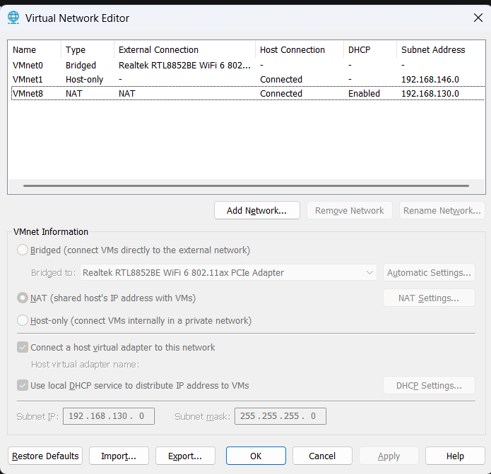

# 1. VMware Workstation Setup

## Purpose
Configure the virtual networks and VM hardware settings required for the lab.

## Steps

### 1.1 Virtual Network Editor

1. Open VMware Workstation.
2. Go to **Edit > Virtual Network Editor**.
3. Click **"Change Settings"** (requires admin rights).
4. Select **VMnet0** (Bridged) and set it to **"Bridged to:"** your active physical adapter (Wi‑Fi or Ethernet) – **do not leave it on "Automatic"**.
5. Click **Add Network...**, select **VMnet2**, and set it to **Host‑only**.
6. For VMnet2, **uncheck "Use local DHCP service"** – we will let the FortiGate handle DHCP.
7. Click **Apply** and **OK**.

### 1.2 VM Hardware Settings

**FortiGate VM:**
- **CPU:** 1 vCPU
- **Memory:** 2048 MB (2 GB)
- **Network Adapter 1:** Bridged (VMnet0) → this becomes `port1` (WAN)
- **Network Adapter 2:** Custom (VMnet2) → this becomes `port2` (LAN)

**Windows 10 VM:**
- **Network Adapter:** Custom (VMnet2) → connects to the LAN side.

> **Important:** The free permanent license requires exactly **1 vCPU** and **2 GB RAM** – no more, no less. If you allocate more, the license validation will fail.

### 1.3 Verification

- Power on both VMs.
- On the FortiGate, run `get system interface physical` to confirm both `port1` and `port2` show `Link: up`.