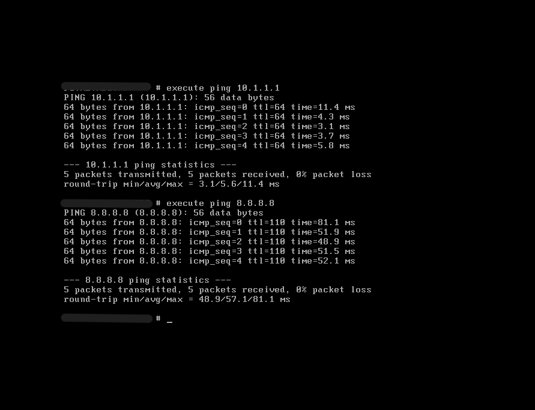

# 2. FortiGate VM Deployment

## Purpose
Deploy the FortiGate VM from the OVF/OVA template and perform initial boot configuration.

## Steps

### 2.1 Deploy the VM

1. In VMware Workstation, go to **File > Open** and select the `.ovf` file of the FortiGate image.
2. Set the VM name and storage location.
3. Power on the VM.

### 2.2 Initial Login

- On first boot, log in with:
  - **Username:** `admin`
  - **Password:** (blank – just press Enter)
- Change the admin password when prompted.

### 2.3 Configure WAN Interface (port1)

Assign a static IP to `port1` (the WAN/management interface). Replace `10.1.1.220` with your own IP if needed.

```bash
config system interface
    edit port1
        set mode static
        set ip 10.1.1.220 255.255.255.0
        set allowaccess ping https ssh
    end
```
### 2.4 Set Default Gateway

```bash
config router static
    edit 1
        set device port1
        set gateway 10.1.1.1
    next
end
```

### 2.5 Set DNS Servers
```bash
config system dns
    set primary 8.8.8.8
    set secondary 8.8.4.4
end
```

### 2.6 Verify Connectivity

```bash
execute ping 10.1.1.1
execute ping 8.8.8.8
```
Both should succeed. If not, check your VMware bridging settings and physical adapter binding.


